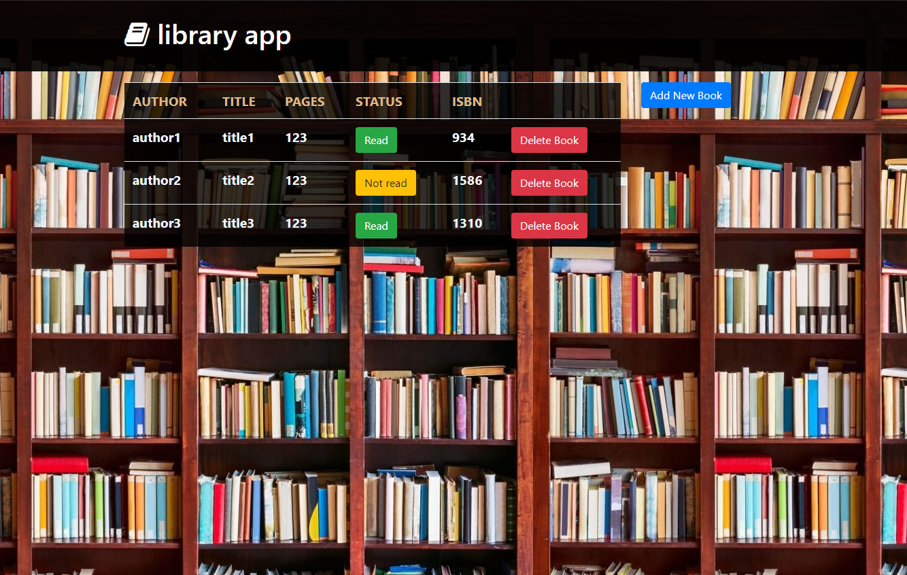

# Library-Javascript

> A simple library page built with javascript and DOM.



Additional description about the project and its features.

## Built With

- HTML/CSS,
- JavaScript,
- Bootstrap.

## Live Demo

[Live Demo Link](https://christianotieno.github.io/library-javascript/)

## Getting Started

**Below are the instructions on setting up the project locally.**

To get a local copy up and running follow these simple example steps.

### Setup and installation

```
git clone git@github.com:ChristianOtieno/library-javascript.git
```

### Usage

```
run live server
```

### Run tests

```
npx eslint .
```

## Authors

👤 **Author1**

- Github: [@ChristianOtieno](https://github.com/ChristianOtieno)
- Twitter: [@iamchrisotieno](https://twitter.com/iamchrisotieno)
- Linkedin: [Christian Otieno](https://linkedin.com/linkedinhandle)

👤 **Author2**

- Github: [@ermin-cahtarevic](https://github.com/ermin-cahtarevic)
- Twitter: [@ErminCahtarevic](https://twitter.com/ErminCahtarevic)
- Linkedin: [Ermin Cahtarevic](https://www.linkedin.com/in/ermincahtarevic/)

## 🤝 Contributing

Contributions, issues and feature requests are welcome!

Feel free to check the [issues page](https://github.com/ChristianOtieno/library-javascript/issues).

## Show your support

Give a ⭐️ if you like this project!

## Acknowledgments

- Hat tip to anyone whose code was used
- Inspiration.

## 📝 License

This project is [MIT](https://opensource.org/licenses/MIT) licensed.
